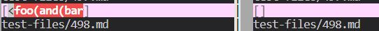

# __Week 10 Lab Report__ 

## How I Found the Differing Tests
I told remote computer to write all the results of the tests into a txt file called result.txt. Then I used vim diff to compare the two result.txt to see when we had different results. [This](https://github.com/nidhidhamnani/markdown-parser/blob/main/test-files/493.md) is the link to my first test and [this](https://github.com/nidhidhamnani/markdown-parser/blob/main/test-files/498.md) is the link to my second file. 

## Test File #1
I believe my version of MarkdownParse is correct because according to the [CommonMark Demo Site](https://spec.commonmark.org/dingus/), the text in the md file is not a link. The preview shown on the website is ``[link]()``. The expected result should ``[]``

 Here is the screenshot of the results:

The left side is the given MarkdownParse's result and the right is my personal MarkdownParse. This will be the same for any other screenshot that is meant to compare the two results. 

For the given implementation, I think the bug with the code is that it doesn't check whether there is a line break or not when making a link. Though I'm not sure how check for a line break, you most likely have to check for it at the end. I suggest checking it here

right before the else statement and adding an if statement that checks for a line break with the parentheses. 

## Test File #2

I believe the given implementation is correct because my code doesn't register the text in the md file as a link. It is a link once again according to the  [CommonMark Demo Site](https://spec.commonmark.org/dingus/). The preview shown on the website is ``link``. The expected result should ``[<foo(and(bar]``.

Here is the screenshot of the results:

For my implementation, I think the bug with the code is that it doesn't check recognize ``<>`` (the two carrots) as valid characters inside the parentheses. I think some of my checks might be a bit too strict, so I would need to tinker with that I expect to fix some of my code here:

