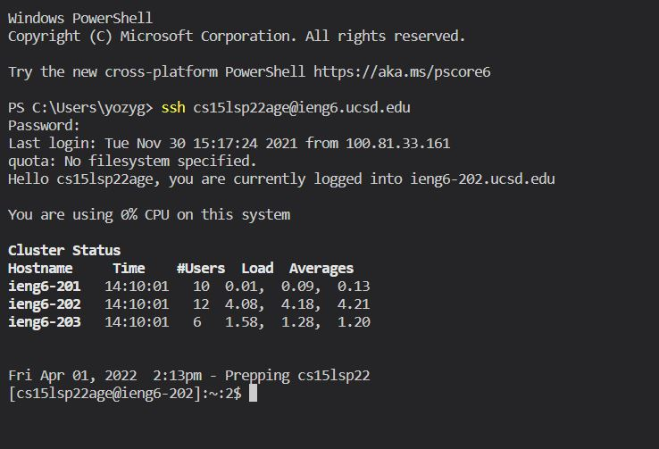

# Week 2 Lab Report 
## 1. Installing VS Code
Go to [Visual Studio Code](https://code.visualstudio.com/) and download it for whatever system you have. Once you have downloaded and opened Visual Studio Code, you should have something like this: 

## 2. Remotely Connecting 
Follow these [instructions](https://cdn-uploads.piazza.com/paste/ktv2gnof3sx5bf/181c3cb053df5cf1ccaf0457f56f12a2e5aa90b139aef8c2ea8fcc590f02fadf/How-to-Reset-your-Password.pdf) to reset your password for your cse 15L server account and find out your account name. Once your password has been reset, open up Visual Studio Code, and on the top right, open up a new terminal and connect to the 

 

## 3. Trying Some Commands

## 4. Moving Files with `scp`

## 5. Setting an SSH Key 

## 6. Optimizing Remote Key 

