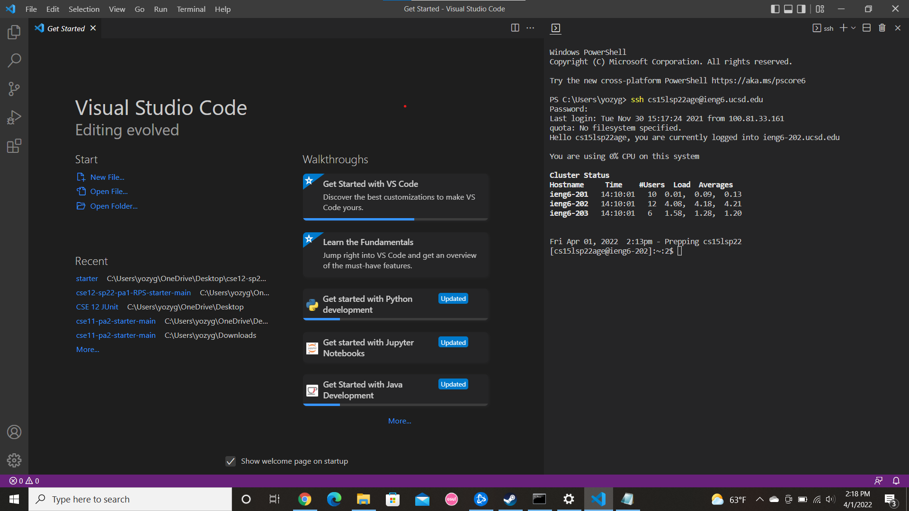
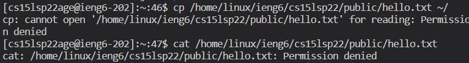
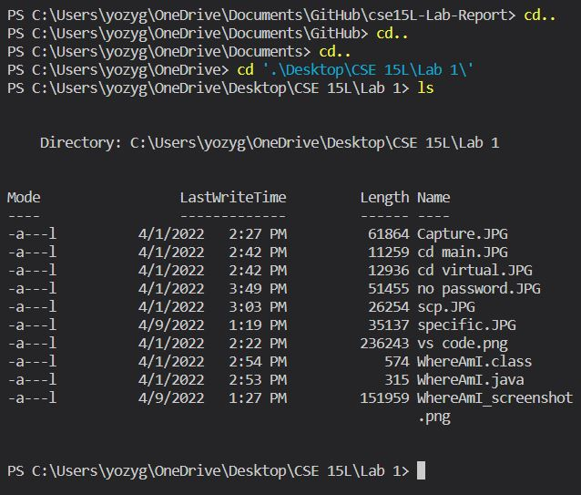
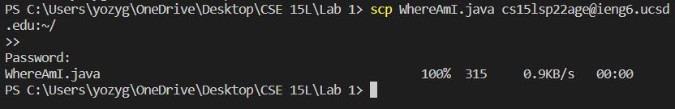
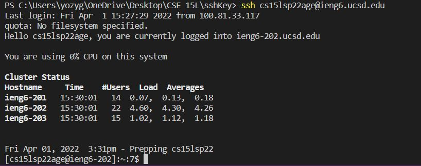
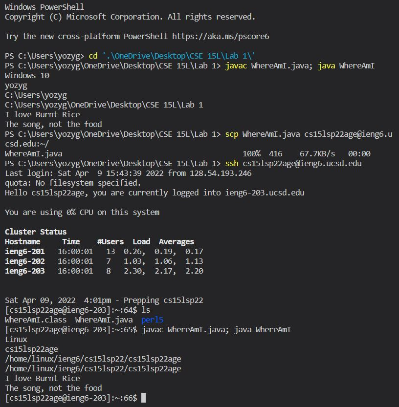

# Week 2 Lab Report 
## 1. Installing VS Code
Go to [Visual Studio Code](https://code.visualstudio.com/) and download it for whatever system you have. Once you have downloaded and opened Visual Studio Code, you should have something like this:
 

## 2. Remotely Connecting 
On the top right of VS Code, open up a new terminal and write the command:
>`ssh [YOUR_ACCOUNT_NAME]@ieng6.ucsd.edu`

If this is your first time logging in, it will ask you something about if you are sure about connecting. Type yes. Then it will prompt you to type your password, which should be the password you reseted for Lab 1 Prereq. If done successfully, you should have something like this:  

 

## 3. Trying Some Commands
There are many commands you can try once you enter the remote computer. A list of these would be:
* `ls`
* `cd ..`
* `pwd`
* `mkdir [DIRECTORY_NAME]`
* `rmdir [DIRECTORY_NAME]` (Note: rmdir removes a directory, so use with **caution**)

You can also try these more specific commands:
* `cp /home/linux/ieng6/cs15lsp22/public/hello.txt ~/`
* `cat /home/linux/ieng6/cs15lsp22/public/hello.txt`

For these commands, your output shoould look something like this:

There are many more commands for you to try if you go do a Google search. I provided the ones I thought would be the most helpful.

## 4. Moving Files with `scp`
To move files from your computer to the remote computer, first create a file you want to move. Then on your terminal, make sure you are in the correct directory of where your file is. Here is an example of me changing directory to the directory of WhereAmI.java.  

> Note: you can use tab to autofill directories

Once you are in the directory copy and paste this command into your terminal:

`scp [FILE_NAME] [ACCOUNT_NAME]@ieng6.ucsd.edu:~/`

Now enter in the password once prompted and you should get a message like this:

You can confirm it is in your remote computer by logging back into your remote computer and using `ls` in your terminal. If you created a java file, you can `javac` and `java` to compile and run it in the remote computer. 

## 5. Setting an SSH Key 
Make sure you are on your local computer's terminal. Now do the command: 

>`ssh-keygen` 

You will see be prompted to enter a file in which to save the key. Use this as your file: 

>`/Users/<user-name>/.ssh/id_rsa` (Note: your user-name is specific to your computer. Mine is yozygao) 

After, keep pressing enter and until you see this message: 

>`The key's randomart image is:` + lines and random numbers and letters below it. 

With the ssh key generated, go into your remote computer and create a directory called .ssh by using this command:

>`mkdir .ssh`

Exit out of the remote computer and use this command to copy the ssh key into your remote computer:

>`scp /Users/<user-name>/.ssh/id_rsa.pub cs15lsp22zz@ieng6.ucsd.edu:~/.ssh/authorized_keys`

Once you have copied it, you should be able to log into your remote computer without entering in a password like this: 

## 6. Optimizing Remote Running 

Here is the fastest way I found to make a local edit and the copying it over to my remote computer from a fresh terminal:

I first changed into the directory of my `WhereAmI.java` file. I compiled and ran it on a single line to show I did indeed modify it. Then I copied it over to the remote computer via the `scp` command. I logged into the remote computer to confirm the file is there via `ls` and then compiled and ran it to make sure the edits went through. 

Tips:
* Use tab whenever to see if the terminal will autofill what you want. 
* You can use semicolon to run multiple commands in succession

