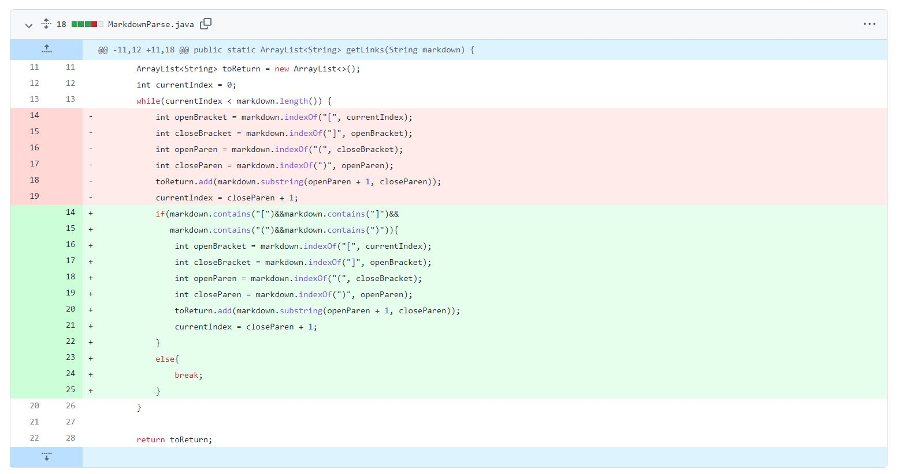
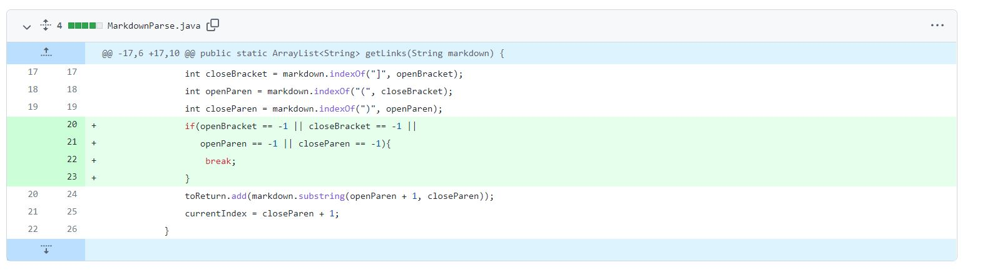
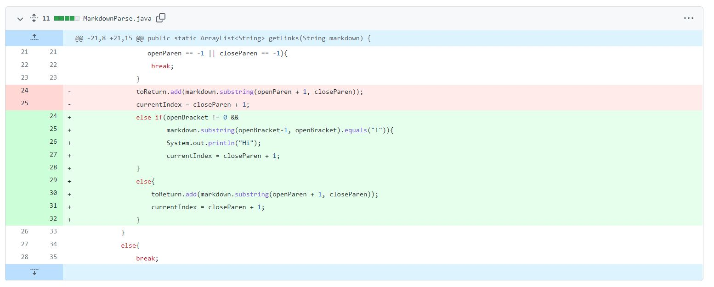

# Week 4 Lab Report 

## __My First Code Change__

Link to my [first test file](https://github.com/yozygao/markdown-parser/blob/main/test-file2.md)

### _Output of Running the File:_
`Exception in thread "main" java.lang.StringIndexOutOfBoundsException: begin 0, end -1, length 2
        at java.base/java.lang.String.checkBoundsBeginEnd(String.java:3319)
        at java.base/java.lang.String.substring(String.java:1874)    
        at MarkdownParse.getLinks(MarkdownParse.java:18)
        at MarkdownParse.main(MarkdownParse.java:29)`

### _Explanation:_
The code didn't account for what would happen if you gave it an empty file with at least two lines. The `indexOf` returns a `-1` when it doesn't any of the brackets or parentheses. When it runs the `substring` function, it breaks as there is no `-1` index. I fixed this by adding a check for the brackets and parentheses. 

## __My Second Code Change__ 

Link to my [second test file](https://github.com/yozygao/markdown-parser/blob/main/test-file4.md)

### _Output of Running the File_
`Exception in thread "main" java.lang.OutOfMemoryError: Java heap space
        at java.base/java.lang.StringLatin1.newString(StringLatin1.java:715)
        at java.base/java.lang.String.substring(String.java:1879)    
        at MarkdownParse.getLinks(MarkdownParse.java:18)
        at MarkdownParse.main(MarkdownParse.java:29)`

### _Explanation_
The code goes into an infinite loop as current index because once it goes through one iteration of the while loop, `closeParen` gets set to `-1`, which makes the `index` to never increment. If it never increments, the while loops goes on forever, which is whar causes that error. I fixed this by adding a check if `openBracket`, `closeBracket`, `openParen`, or `closeParen` were ever set to `-1`, then break the loop. 

## __My Third Code Change__

Link to my [third test file](https://github.com/yozygao/markdown-parser/blob/main/test-file3.md)

### _Output of Running the File_
`[https://something.com]`

### _Explanation_
Although it looks like this is correct, the test file used is actually used to show an image, not a link. The code doesn't check differentiate between an image or a link as it only checks for the brackets and parentheses. The only difference between a link and an image is the exclamation point, so I added a check for that to skip it and move on to the next link. 
