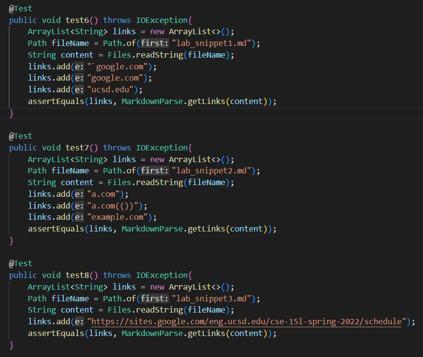
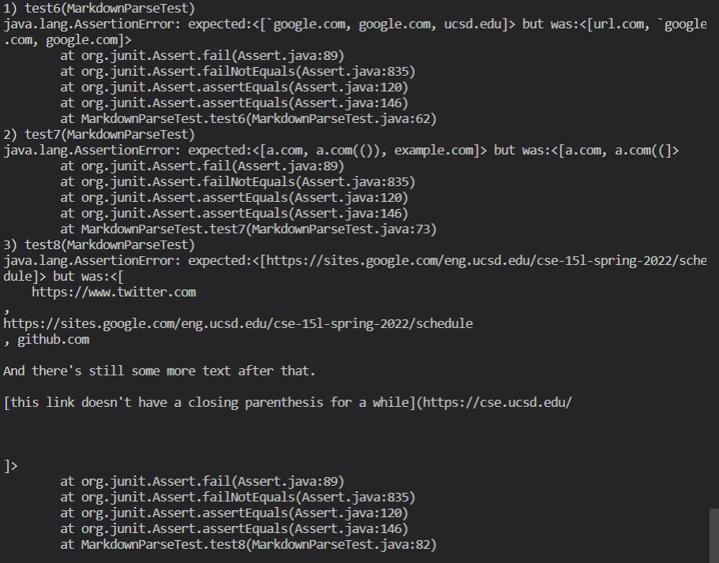
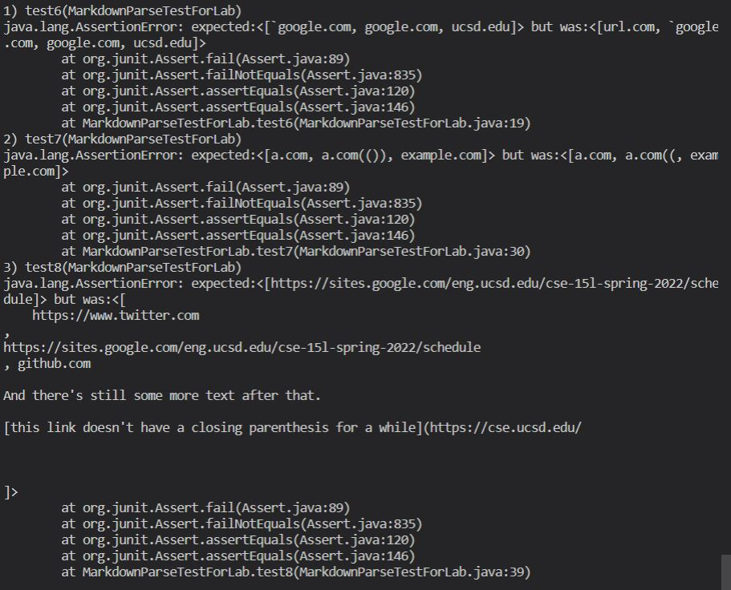

# __Week 8 Lab Report__

### _Link to my repo:_ 
https://github.com/yozygao/markdown-parser
### _Link to reviewed repo:_
https://github.com/henrigy/markdown-parser

## _Expected Results:_
### Snippet 1:
It should produce: [`google.com, google.com, ucsd.edu]
### Snippet 2:
It should produce: [a.com, a.com(()), example.com]
### Snippet 3:
It should produce: 
[https://sites.google.com/eng.ucsd.edu/cse-15l-spring-2022/schedule]

## _The Test and Results for the Snippets:_

### How I turned those snippets into a JUnit test:

### None of the tests passed for my implementation:

### None of the tests passed for the implementation of the repo I reviewed in Lab 7:

## _Changes I Can Make?_

### Snippet 1:
I think there is a possible small change you can make. The change I was thinking of is if there contains a backtick after the last close parentheses, but before this open bracket and there contains a backtick between this open bracket and this close bracket, then move on to the next link. This should work because it would eliminate that first fake link from being added to the array. 

### Snippet 2:
Similar to snippet 1, I think you can do the same logic by checking if there are backslashes and brackets right after it. If there is, then skip that bracket index and look for the open parentheses.

### Snippet 3:
I don't think there is a possible change because you have to account for line breaks and the way we check for links is by parsing the md file into a string. There is no representation of a line break in string form, so we would need to find a new way of parsing the md file to check for line breaks.

