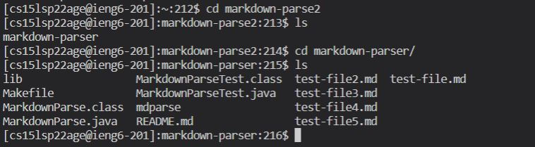
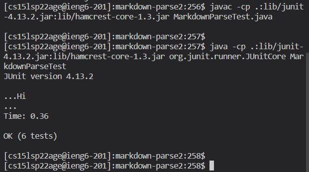
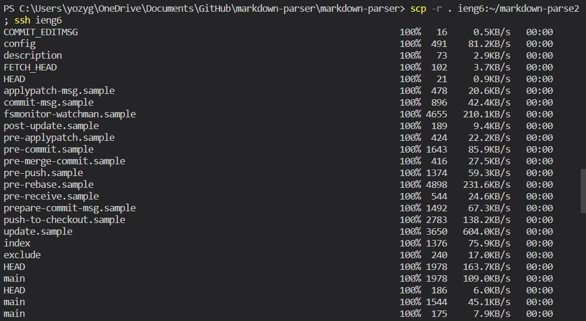
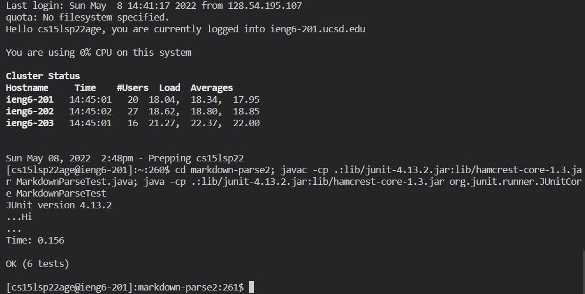

# Lab Report 3 

## Streamlining SSH Configuration

This is my config file from .ssh. I edited the file by adding a `Host`, `HostName`, and `User` and then filling it out with my information. 

My chosen alia was __ieng6__, so I used that to login to the remote computer. It worked as expected and I didn't need to use my username or my password. 

I created a file called testFile.java and then I copied into my remote computer without using my username and using the alias I created in the config file. 

## Setup GitHub Access From ieng6

I first created an SSH key that is stored in my user account. You have to click my profile picture on the top right and then: Settings -> SSH and GPG keys. After this, you should be able to see the SSH key shown above. 

My private key is stored on the remote computer in the .ssh directory. I show it here using `cd .ssh` to first change my current directory into the .ssh file in my remote computer and then using `ls` to show all the files within this directory. As shown by `ls`, this is where my private key is stored. 

Here, I change a `test-file.md` within `markdown-parser` using `vim`. After changing it, I `git add test-file.md` and then `git commit` right after. After a bit of troubleshooting, I was able to do `git push origin main` successfully. Here is the [link](https://github.com/yozygao/markdown-parser/commit/ca0f9bc0eed56a3b9ef1f8db180dbf476ab63412) to my commit in GitHub.

## Copy Whole Directories with `scp-r`

Here, I show the `markdown-parser` directory that I copied into the remote computer. I am not too sure what all those extra lines are when copying the directory, but when I log in to my remote computer, move into that copied directory and `ls`, all the expected files are there. 

After copying the `markdown-parser` directory into the terminal, I am able to compile and run the tests within the remote computer. Since the remote computer is Linux-based, I use the Linux/Mac commands to run the tests. 

I was unable to use only one line to run the tests as there was an `Unsupported Class` error when I tried to do it all on one line. This was the command I used:

`scp -r . ieng6:markdown-parse2; ssh ieng6 "cd markdown-parse2; javac -cp .:lib/junit-4.13.2.jar:lib/hamcrest-core-1.3.jar MarkdownParseTest.java; java -cp .:lib/junit-4.13.2.jar:lib/hamcrest-core-1.3.jar org.junit.runner.JUnitCore MarkdownParseTest"`

Instead, I split that line into two lines. The first line copied the directory and logged into the remote computer. The second line moved into `markdown-parse2` and compiled and ran the tests. 
